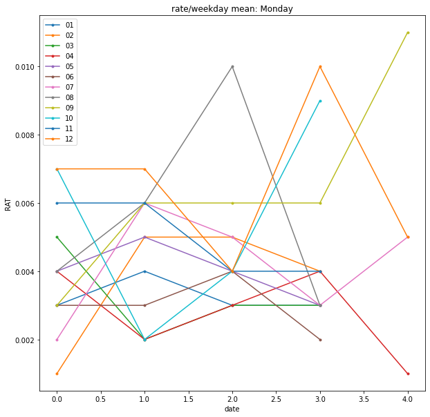

# 시청률 요일별 분석

## 1. 미리보기

칼럼: 분단위 시간대(string?), 367일간의 날짜별 시청률(float)

NaN값은 없어보인다. 시간대를 인덱스로 바꿔도 괜찮을 듯?


```python
import pandas as pd

rating = pd.read_csv(r'./raw/시청률.csv')

print(rating.shape)

rating.info()
```

    (1441, 367)
    <class 'pandas.core.frame.DataFrame'>
    RangeIndex: 1441 entries, 0 to 1440
    Columns: 367 entries, 시간대 to 2019-01-01 to 2019-12-31
    dtypes: float64(366), object(1)
    memory usage: 4.0+ MB
    


```python
rating.head()
```


<div>
<table border="1" class="dataframe">
  <thead>
    <tr style="text-align: right;">
      <th></th>
      <th>시간대</th>
      <th>2019-01-01</th>
      <th>2019-01-02</th>
      <th>2019-01-03</th>
      <th>2019-01-04</th>
      <th>2019-01-05</th>
      <th>2019-01-06</th>
      <th>2019-01-07</th>
      <th>2019-01-08</th>
      <th>2019-01-09</th>
      <th>...</th>
      <th>2019-12-23</th>
      <th>2019-12-24</th>
      <th>2019-12-25</th>
      <th>2019-12-26</th>
      <th>2019-12-27</th>
      <th>2019-12-28</th>
      <th>2019-12-29</th>
      <th>2019-12-30</th>
      <th>2019-12-31</th>
      <th>2019-01-01 to 2019-12-31</th>
    </tr>
  </thead>
  <tbody>
    <tr>
      <th>0</th>
      <td>02:00</td>
      <td>0.0</td>
      <td>0.0</td>
      <td>0.000</td>
      <td>0.0</td>
      <td>0.0</td>
      <td>0.0</td>
      <td>0.0</td>
      <td>0.0</td>
      <td>0.0</td>
      <td>...</td>
      <td>0.0</td>
      <td>0.0</td>
      <td>0.000</td>
      <td>0.0</td>
      <td>0.0</td>
      <td>0.0</td>
      <td>0.0</td>
      <td>0.0</td>
      <td>0.000</td>
      <td>0.003</td>
    </tr>
    <tr>
      <th>1</th>
      <td>02:01</td>
      <td>0.0</td>
      <td>0.0</td>
      <td>0.000</td>
      <td>0.0</td>
      <td>0.0</td>
      <td>0.0</td>
      <td>0.0</td>
      <td>0.0</td>
      <td>0.0</td>
      <td>...</td>
      <td>0.0</td>
      <td>0.0</td>
      <td>0.000</td>
      <td>0.0</td>
      <td>0.0</td>
      <td>0.0</td>
      <td>0.0</td>
      <td>0.0</td>
      <td>0.012</td>
      <td>0.003</td>
    </tr>
    <tr>
      <th>2</th>
      <td>02:02</td>
      <td>0.0</td>
      <td>0.0</td>
      <td>0.000</td>
      <td>0.0</td>
      <td>0.0</td>
      <td>0.0</td>
      <td>0.0</td>
      <td>0.0</td>
      <td>0.0</td>
      <td>...</td>
      <td>0.0</td>
      <td>0.0</td>
      <td>0.000</td>
      <td>0.0</td>
      <td>0.0</td>
      <td>0.0</td>
      <td>0.0</td>
      <td>0.0</td>
      <td>0.000</td>
      <td>0.004</td>
    </tr>
    <tr>
      <th>3</th>
      <td>02:03</td>
      <td>0.0</td>
      <td>0.0</td>
      <td>0.014</td>
      <td>0.0</td>
      <td>0.0</td>
      <td>0.0</td>
      <td>0.0</td>
      <td>0.0</td>
      <td>0.0</td>
      <td>...</td>
      <td>0.0</td>
      <td>0.0</td>
      <td>0.017</td>
      <td>0.0</td>
      <td>0.0</td>
      <td>0.0</td>
      <td>0.0</td>
      <td>0.0</td>
      <td>0.000</td>
      <td>0.004</td>
    </tr>
    <tr>
      <th>4</th>
      <td>02:04</td>
      <td>0.0</td>
      <td>0.0</td>
      <td>0.000</td>
      <td>0.0</td>
      <td>0.0</td>
      <td>0.0</td>
      <td>0.0</td>
      <td>0.0</td>
      <td>0.0</td>
      <td>...</td>
      <td>0.0</td>
      <td>0.0</td>
      <td>0.017</td>
      <td>0.0</td>
      <td>0.0</td>
      <td>0.0</td>
      <td>0.0</td>
      <td>0.0</td>
      <td>0.000</td>
      <td>0.004</td>
    </tr>
  </tbody>
</table>
<p>5 rows × 367 columns</p>
</div>


맨 우측 칼럼은 1월1일~12월31일 이라고 써있다. 해당 시간대의 1년간 평균인 듯 하다.

시간대 / 01.01~12.31 / 시간별 1년간 총합

이렇게 3가지 데이터프레임으로 나눠보자.


### 1-1. 시간대 

시간대를 저장하는 판다스의 시리즈 타입, 그리고 리스트타입 총 두가지 형태로 저장한다.

그런데 맨 마지막 값이 이상하다. 이것도 1년간의 평균을 세는데 쓴 것 같다. 일단은 보류.


```python
time = rating['시간대'] #Series - pandas
time_list = time.values.tolist() #리스트 타입
```


```python
### list type ###
print(time_list[:5])
print(time_list[-5:])

### pandas - series type ###
time.head()
```

    ['02:00', '02:01', '02:02', '02:03', '02:04']
    ['01:56', '01:57', '01:58', '01:59', '월화수목금토일02:00-01:59']
    


    0    02:00
    1    02:01
    2    02:02
    3    02:03
    4    02:04
    Name: 시간대, dtype: object


### 1-2. 1월1일~12월31일까지의 시청률

맨 마지막 값은 일별 평균 혹은 총합인 듯 하다. 이것도 일단 보류.


```python
year_df = rating.drop(['시간대','2019-01-01 to 2019-12-31'],axis=1)
year_df
```


<div>
<table border="1" class="dataframe">
  <thead>
    <tr style="text-align: right;">
      <th></th>
      <th>2019-01-01</th>
      <th>2019-01-02</th>
      <th>2019-01-03</th>
      <th>2019-01-04</th>
      <th>2019-01-05</th>
      <th>2019-01-06</th>
      <th>2019-01-07</th>
      <th>2019-01-08</th>
      <th>2019-01-09</th>
      <th>2019-01-10</th>
      <th>...</th>
      <th>2019-12-22</th>
      <th>2019-12-23</th>
      <th>2019-12-24</th>
      <th>2019-12-25</th>
      <th>2019-12-26</th>
      <th>2019-12-27</th>
      <th>2019-12-28</th>
      <th>2019-12-29</th>
      <th>2019-12-30</th>
      <th>2019-12-31</th>
    </tr>
  </thead>
  <tbody>
    <tr>
      <th>0</th>
      <td>0.000</td>
      <td>0.000</td>
      <td>0.000</td>
      <td>0.000</td>
      <td>0.000</td>
      <td>0.000</td>
      <td>0.000</td>
      <td>0.000</td>
      <td>0.000</td>
      <td>0.000</td>
      <td>...</td>
      <td>0.000</td>
      <td>0.000</td>
      <td>0.000</td>
      <td>0.000</td>
      <td>0.000</td>
      <td>0.000</td>
      <td>0.000</td>
      <td>0.000</td>
      <td>0.000</td>
      <td>0.000</td>
    </tr>
    <tr>
      <th>1</th>
      <td>0.000</td>
      <td>0.000</td>
      <td>0.000</td>
      <td>0.000</td>
      <td>0.000</td>
      <td>0.000</td>
      <td>0.000</td>
      <td>0.000</td>
      <td>0.000</td>
      <td>0.005</td>
      <td>...</td>
      <td>0.000</td>
      <td>0.000</td>
      <td>0.000</td>
      <td>0.000</td>
      <td>0.000</td>
      <td>0.000</td>
      <td>0.000</td>
      <td>0.000</td>
      <td>0.000</td>
      <td>0.012</td>
    </tr>
    <tr>
      <th>2</th>
      <td>0.000</td>
      <td>0.000</td>
      <td>0.000</td>
      <td>0.000</td>
      <td>0.000</td>
      <td>0.000</td>
      <td>0.000</td>
      <td>0.000</td>
      <td>0.000</td>
      <td>0.005</td>
      <td>...</td>
      <td>0.000</td>
      <td>0.000</td>
      <td>0.000</td>
      <td>0.000</td>
      <td>0.000</td>
      <td>0.000</td>
      <td>0.000</td>
      <td>0.000</td>
      <td>0.000</td>
      <td>0.000</td>
    </tr>
    <tr>
      <th>3</th>
      <td>0.000</td>
      <td>0.000</td>
      <td>0.014</td>
      <td>0.000</td>
      <td>0.000</td>
      <td>0.000</td>
      <td>0.000</td>
      <td>0.000</td>
      <td>0.000</td>
      <td>0.005</td>
      <td>...</td>
      <td>0.000</td>
      <td>0.000</td>
      <td>0.000</td>
      <td>0.017</td>
      <td>0.000</td>
      <td>0.000</td>
      <td>0.000</td>
      <td>0.000</td>
      <td>0.000</td>
      <td>0.000</td>
    </tr>
    <tr>
      <th>4</th>
      <td>0.000</td>
      <td>0.000</td>
      <td>0.000</td>
      <td>0.000</td>
      <td>0.000</td>
      <td>0.000</td>
      <td>0.000</td>
      <td>0.000</td>
      <td>0.000</td>
      <td>0.005</td>
      <td>...</td>
      <td>0.000</td>
      <td>0.000</td>
      <td>0.000</td>
      <td>0.017</td>
      <td>0.000</td>
      <td>0.000</td>
      <td>0.000</td>
      <td>0.000</td>
      <td>0.000</td>
      <td>0.000</td>
    </tr>
    <tr>
      <th>...</th>
      <td>...</td>
      <td>...</td>
      <td>...</td>
      <td>...</td>
      <td>...</td>
      <td>...</td>
      <td>...</td>
      <td>...</td>
      <td>...</td>
      <td>...</td>
      <td>...</td>
      <td>...</td>
      <td>...</td>
      <td>...</td>
      <td>...</td>
      <td>...</td>
      <td>...</td>
      <td>...</td>
      <td>...</td>
      <td>...</td>
      <td>...</td>
    </tr>
    <tr>
      <th>1436</th>
      <td>0.000</td>
      <td>0.000</td>
      <td>0.000</td>
      <td>0.000</td>
      <td>0.027</td>
      <td>0.000</td>
      <td>0.000</td>
      <td>0.000</td>
      <td>0.000</td>
      <td>0.000</td>
      <td>...</td>
      <td>0.000</td>
      <td>0.013</td>
      <td>0.000</td>
      <td>0.000</td>
      <td>0.000</td>
      <td>0.015</td>
      <td>0.000</td>
      <td>0.000</td>
      <td>0.000</td>
      <td>0.000</td>
    </tr>
    <tr>
      <th>1437</th>
      <td>0.000</td>
      <td>0.000</td>
      <td>0.000</td>
      <td>0.000</td>
      <td>0.000</td>
      <td>0.000</td>
      <td>0.000</td>
      <td>0.000</td>
      <td>0.004</td>
      <td>0.000</td>
      <td>...</td>
      <td>0.000</td>
      <td>0.013</td>
      <td>0.000</td>
      <td>0.000</td>
      <td>0.000</td>
      <td>0.015</td>
      <td>0.000</td>
      <td>0.000</td>
      <td>0.000</td>
      <td>0.000</td>
    </tr>
    <tr>
      <th>1438</th>
      <td>0.000</td>
      <td>0.000</td>
      <td>0.000</td>
      <td>0.000</td>
      <td>0.000</td>
      <td>0.000</td>
      <td>0.000</td>
      <td>0.000</td>
      <td>0.004</td>
      <td>0.000</td>
      <td>...</td>
      <td>0.000</td>
      <td>0.013</td>
      <td>0.017</td>
      <td>0.000</td>
      <td>0.000</td>
      <td>0.015</td>
      <td>0.000</td>
      <td>0.000</td>
      <td>0.019</td>
      <td>0.000</td>
    </tr>
    <tr>
      <th>1439</th>
      <td>0.000</td>
      <td>0.000</td>
      <td>0.000</td>
      <td>0.000</td>
      <td>0.000</td>
      <td>0.000</td>
      <td>0.000</td>
      <td>0.000</td>
      <td>0.004</td>
      <td>0.000</td>
      <td>...</td>
      <td>0.000</td>
      <td>0.013</td>
      <td>0.000</td>
      <td>0.000</td>
      <td>0.000</td>
      <td>0.015</td>
      <td>0.000</td>
      <td>0.000</td>
      <td>0.000</td>
      <td>0.000</td>
    </tr>
    <tr>
      <th>1440</th>
      <td>0.004</td>
      <td>0.006</td>
      <td>0.002</td>
      <td>0.003</td>
      <td>0.002</td>
      <td>0.003</td>
      <td>0.003</td>
      <td>0.002</td>
      <td>0.003</td>
      <td>0.002</td>
      <td>...</td>
      <td>0.004</td>
      <td>0.010</td>
      <td>0.006</td>
      <td>0.006</td>
      <td>0.007</td>
      <td>0.004</td>
      <td>0.006</td>
      <td>0.004</td>
      <td>0.005</td>
      <td>0.005</td>
    </tr>
  </tbody>
</table>
<p>1441 rows × 365 columns</p>
</div>


### 1-3. 시간대별 1년간 총합? 평균? 

시간대와 마찬가지로, 시리즈와 리스트 두가지 타입으로 저장해둔다.


```python
year_mean = rating['2019-01-01 to 2019-12-31'] #Series - pandas
mean_list = year_mean.values.tolist() #리스트 타입
```


```python
### list type ###
print(mean_list[:5])
print(mean_list[-5:])

### pandas - series type ###
year_mean.head()
```

    [0.003, 0.003, 0.004, 0.004, 0.004]
    [0.004, 0.004, 0.004, 0.004, 0.004]
    


    0    0.003
    1    0.003
    2    0.004
    3    0.004
    4    0.004
    Name: 2019-01-01 to 2019-12-31, dtype: float64


## 2. 총합 분석

엑셀 기준 맨 끝에 위치하는 행과 열은 시청률 평균을 나타낸 것 같다. 

일단 이걸로 도표를 짜보자.


```python
year_mean = pd.Series(mean_list,index=time_list)
year_mean
```


    02:00                 0.003
    02:01                 0.003
    02:02                 0.004
    02:03                 0.004
    02:04                 0.004
                          ...  
    01:56                 0.004
    01:57                 0.004
    01:58                 0.004
    01:59                 0.004
    월화수목금토일02:00-01:59    0.004
    Length: 1441, dtype: float64


일단은 맨 마지막 인덱스 이름이 이상하다는걸 알았다. 이름을 바꾸자.


```python
time_list[-1] = 'total'
```

인덱스를 시간으로 지정하면 x축이 너무 지저분하게 나온다. 범위를 바꿀 수 있을것같은데...

일단 내일 좀 더 찾아보고 수정하기로.

### 일별 평균 시청률 시리즈를 만든다.


```python
meanYear = rating.drop(['시간대','2019-01-01 to 2019-12-31'],axis=1)
meanYear = meanYear.iloc[1440,:]
meanYear
```


    2019-01-01    0.004
    2019-01-02    0.006
    2019-01-03    0.002
    2019-01-04    0.003
    2019-01-05    0.002
                  ...  
    2019-12-27    0.004
    2019-12-28    0.006
    2019-12-29    0.004
    2019-12-30    0.005
    2019-12-31    0.005
    Name: 1440, Length: 365, dtype: float64


# 요일별로 평균그래프를 그려보자!!

우선 인덱스를 새로 만든다.


```python
from pandas import DataFrame as df

meanYear_df = meanYear.reset_index()
meanYear_df
```


<div>
<table border="1" class="dataframe">
  <thead>
    <tr style="text-align: right;">
      <th></th>
      <th>index</th>
      <th>1440</th>
    </tr>
  </thead>
  <tbody>
    <tr>
      <th>0</th>
      <td>2019-01-01</td>
      <td>0.004</td>
    </tr>
    <tr>
      <th>1</th>
      <td>2019-01-02</td>
      <td>0.006</td>
    </tr>
    <tr>
      <th>2</th>
      <td>2019-01-03</td>
      <td>0.002</td>
    </tr>
    <tr>
      <th>3</th>
      <td>2019-01-04</td>
      <td>0.003</td>
    </tr>
    <tr>
      <th>4</th>
      <td>2019-01-05</td>
      <td>0.002</td>
    </tr>
    <tr>
      <th>...</th>
      <td>...</td>
      <td>...</td>
    </tr>
    <tr>
      <th>360</th>
      <td>2019-12-27</td>
      <td>0.004</td>
    </tr>
    <tr>
      <th>361</th>
      <td>2019-12-28</td>
      <td>0.006</td>
    </tr>
    <tr>
      <th>362</th>
      <td>2019-12-29</td>
      <td>0.004</td>
    </tr>
    <tr>
      <th>363</th>
      <td>2019-12-30</td>
      <td>0.005</td>
    </tr>
    <tr>
      <th>364</th>
      <td>2019-12-31</td>
      <td>0.005</td>
    </tr>
  </tbody>
</table>
<p>365 rows × 2 columns</p>
</div>


칼럼명 고치기.


```python
meanYear_df.columns = ['date','rating']
meanYear_df.head()
```


<div>
<table border="1" class="dataframe">
  <thead>
    <tr style="text-align: right;">
      <th></th>
      <th>date</th>
      <th>rating</th>
    </tr>
  </thead>
  <tbody>
    <tr>
      <th>0</th>
      <td>2019-01-01</td>
      <td>0.004</td>
    </tr>
    <tr>
      <th>1</th>
      <td>2019-01-02</td>
      <td>0.006</td>
    </tr>
    <tr>
      <th>2</th>
      <td>2019-01-03</td>
      <td>0.002</td>
    </tr>
    <tr>
      <th>3</th>
      <td>2019-01-04</td>
      <td>0.003</td>
    </tr>
    <tr>
      <th>4</th>
      <td>2019-01-05</td>
      <td>0.002</td>
    </tr>
  </tbody>
</table>
</div>


분석에 필요한 정보를 새 칼럼에다 만든다.
1. date: 날짜를 datetime 포맷으로 바꿔준다.
2. day: 그 날짜가 무슨 요일인지 넣는다. (참 편리하다..)
3. month: 몇월인지도 넣는다.


```python
meanYear_df['date'] = pd.to_datetime(meanYear_df['date'], format='%Y/%m/%d')
meanYear_df['day'] = meanYear_df['date'].dt.day_name()
meanYear_df['month'] = meanYear_df['date'].dt.strftime('%m')
meanYear_df.info()
```

    <class 'pandas.core.frame.DataFrame'>
    RangeIndex: 365 entries, 0 to 364
    Data columns (total 4 columns):
     #   Column  Non-Null Count  Dtype         
    ---  ------  --------------  -----         
     0   date    365 non-null    datetime64[ns]
     1   rating  365 non-null    float64       
     2   day     365 non-null    object        
     3   month   365 non-null    object        
    dtypes: datetime64[ns](1), float64(1), object(2)
    memory usage: 11.5+ KB
    

몇월, 무슨 요일을 출력할건지 조건을 함수로 표현한다. (자주 쓰일테니...?)

일단은 필요해서 달과 요일명을 리스트로도 만들었다.

요일명도 제대로 나오고 있다!


```python
def date_case(i,j):
    case_mon = meanYear_df['month'] == month_list[i]
    case_day = meanYear_df['day'] == day_list[j]
    
    return case_mon & case_day

month_list = ['01','02','03','04','05','06','07','08','09','10','11','12']
day_list = ['Monday','Tuesday','Wednesday','Thursday','Friday','Saturday','Sonday']

meanYear_df[date_case(0,0)][['date','rating','day']]
```


<div>
<table border="1" class="dataframe">
  <thead>
    <tr style="text-align: right;">
      <th></th>
      <th>date</th>
      <th>rating</th>
      <th>day</th>
    </tr>
  </thead>
  <tbody>
    <tr>
      <th>6</th>
      <td>2019-01-07</td>
      <td>0.003</td>
      <td>Monday</td>
    </tr>
    <tr>
      <th>13</th>
      <td>2019-01-14</td>
      <td>0.004</td>
      <td>Monday</td>
    </tr>
    <tr>
      <th>20</th>
      <td>2019-01-21</td>
      <td>0.003</td>
      <td>Monday</td>
    </tr>
    <tr>
      <th>27</th>
      <td>2019-01-28</td>
      <td>0.003</td>
      <td>Monday</td>
    </tr>
  </tbody>
</table>
</div>


## (1). 총 31일간의 그래프

아까보단 낫긴 한데 그래도 가독성이 영 별로다. 뭘 고쳐야하지...


```python
import numpy as np
from matplotlib.pyplot import figure

# num = 요일 입력!! ex: 0==월요일

def day_graph1(num):
    figure(num=None, figsize=(12,10))
    
    for i in range(12):
        plt.plot(meanYear_df[date_case(i,num)]['date'].dt.strftime('%d'),
                 meanYear_df[date_case(i,num)]['rating'].to_list(),marker='o',markersize=3)
        
    plt.title('rate/weekday mean: '+day_list[num])
    plt.xlabel('date')
    plt.ylabel('RAT')
    
    plt.legend(month_list,loc='upper left')
    
    plt.show()
    
day_graph1(0)
```


## (2). 절댓값(...?) 그래프

각 포인트마다 이게 며칠인지는 따로 확인해야함.


```python
# num = 요일 입력!! ex: 0==월요일

def day_graph2(num):
    figure(num=None, figsize=(10,10))
    
    for i in range(12):
        plt.plot(meanYear_df[date_case(i,num)]['rating'].to_list(),marker='o',markersize=3)
        
    plt.title('rate/weekday mean: '+day_list[num])
    plt.xlabel('date')
    plt.ylabel('RAT')
    
    plt.legend(month_list,loc='upper left')
    
    plt.show()
    
    
day_graph2(0)
```




