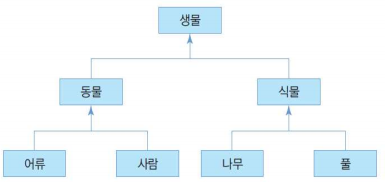
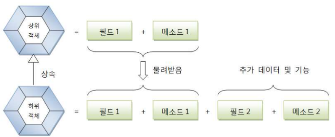
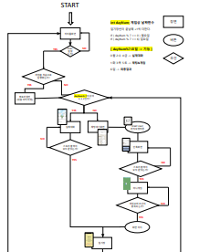
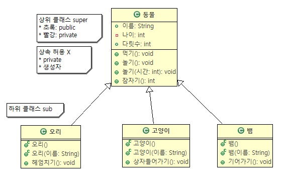
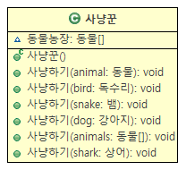
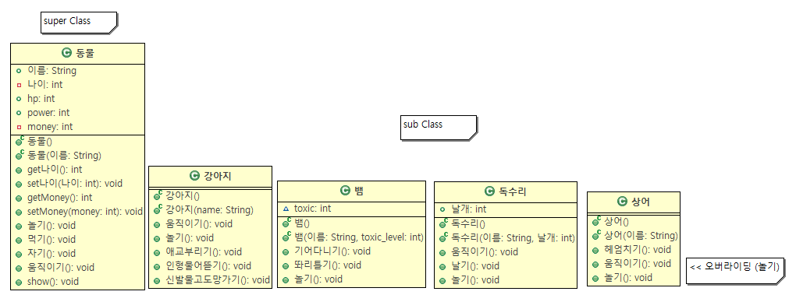
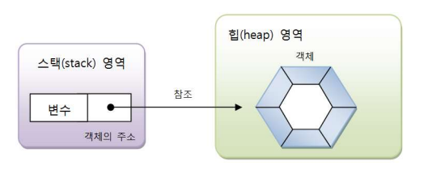

# 클래스와 객체

* [0405 수업 내용](#0405-수업-내용)
* [0408 수업 내용](#0408-수업-내용)
* [0412 수업 내용](#0412-수업-내용)


----

###### 0405 수업 내용

## OOP (Object-Oriented Programming)

<div align=center>


</div>

객체를 기반으로 프로그램을 작성한다.

* `객체`: 데이터 + 기능

  * 개념상의 의미: 어떤 일을 처리하기 위한 `데이터(변수/속성/필드)`와 `기능(메소드/함수)`을 하나로 묶은 것을 구체화한 단위
  * 문법상의 의미: **변수+메소드**

  

* **객체지향기법의 3R**

  * 가독성 (Readability)
  * 재사용성 (Reusability)
  * 신뢰성 (Reliability)


## 캡슐화: 객체지향 프로그래밍의 특징

* 약속되지 않은 부분, **보여줄 필요가 없는 부분**은 **감싸서 숨기는 것**
* 객체의 필드, 메소드를 하나로 묶고 **실제 구현 내용을 감추는 것**
* 외부 객체는 객체 내부 구조를 알지 못한다.
* 외부 객체는 객체가 노출해 제공하는 필드, 메소드만 이용할 수 있다.


### 필드, 메소드를 캡슐화로 보호하는 이유?

* 외부의 잘못된 사용을 막기 위해
* 캡슐화된 멤버를 노출시킬 지, 숨길 지 결정하기 위해


### 캡슐화 방법: 접근 제한자(Access Modifier)

| Type        | 특징                          |
| ----------- | ----------------------------- |
| public      | 모두가 접근 가능              |
| private (★) | 같은 클래스에서만 접근 가능   |
| protected   | 상속된 클래스에서만 접근 가능 |


## 상속: 객체 지향의 특성

<div align=center>



</div>

**상속이란?**

> 공통 부분은 재사용하자!


`상속대상`: 상위 개체의 필드와 메소드 (생성자 제외)

> 즉 하위 객체는 상위 객체의 속성과 메소드를 **모두** 사용한다.


### 상속의 특징

- 하위 객체는 필요시 상위 개체의 메소드를 **재정의**할 수 있다.
- 새로운 개체를 정의할 때, 기존 개체를 **재사용**하는 용도로 사용한다.


**Is-A** 개념으로 상속을 이해할 수 있다.

- 예시: 새로운 클래스 A가 기존 클래스 B를 물려받았을 때
  - `Class A` **Is - A** `Class B`
- **A is B** 가 물리적/개념적으로 타당할 때에만 상속한다.
  - 고양이 다리는 4개, 책상 다리도 4개라 고양이가 책상을 상속하게 했다?? **NO**


### Java에서의 상속

`자식 클래스`가 `부모 클래스`의 `속성, 메소드` 들을 물려받고 기능을 확장한다.

이 때 속성과 메소드는 클래스의 `멤버`라고 칭한다.

- `부모 클래스`: super Class (상위 클래스)
- `자식 클래스`: sub Class (하위 클래스)
  - sub는 super class의 **멤버를 재사용**할 수 있다.
  - sub는 성질에 맞게 **새로운 특성을 추가**할 수 있다.


### 상속의 효과

<div align=center>



</div>


* **반복된 코드의 중복을 줄인다.**
* **유지 보수의 편리성이 있다.**
* **객체의 `다형성`을 구현한다.**


---

###### 0408 수업 내용

## 절차 지향  vs 객체 지향

<div align=center>



</div>

#### 절차 지향 프로그래밍

- **작업을 순서대로 표현**
- 작업은 **함수** 단위로 표현.
- 즉 코드는 작업을 수행하는 **함수들의 집합**이다.

<div align=center>



</div>

#### 객체 지향 프로그래밍

- **객체들간의 상호작용으로 표현**
- 클래스/객체간의 관계성을 파악한 후 프로그래밍
- 어떤 동작에 대한 작업/논리를 부분적으로 절차지향적으로 표현 가능.


## 다형성(Polymorphism): 객체 지향의 특성

- 같은 이름의 메소드가 클래스나 객체에 따라 다르게 동작하도록 구현


#### 다형성의 사례

| Type                          | 특징                                                         |
| ----------------------------- | ------------------------------------------------------------ |
| 메소드 오버로딩(Overloading)  | **같은 이름**이지만, **인자 타입, 인자 수**에 따라 다르게 작동. (return 타입은 관련 X) |
| 메소드 오버라이딩(Overriding) | `super class`에서 **상속받은 메소드**를 `sub class`마다 각자 다르게 구현. |


#### 메소드 오버로딩 예시

<div align=center>



</div>

`사냥하기()` 메소드들은 **같은 이름**이지만, **인자 타입, 인자 수**에 따라 다르게 작동한다.

**단, return 타입이 다른 것은 오버로딩이 아니다!** (오류가 뜰 것)

#### 메소드 오버라이딩 예시

<div align=center>



</div>

`super class`인 `동물`에서 **상속받은 메소드** `놀기()` 를, `sub class`마다 각자 다르게 구현한다.


##### 동물 클래스의 놀기()

``` java
public class 동물 {
    public String 이름;
    private int 나이;
    public int hp;
    public int power;
    private int money;

    public 동물(){
    	System.out.println("동물 한마리 생성");
    }
	// ... 생략 ...
    
    public void 놀기(){
    	System.out.println(이름+"이 산에서 풀을 뜯고 놀아요");
    }
	// ... 생략 ...

}

```


#### 강아지 클래스의 놀기()

``` java
public class 강아지 extends 동물 {

    public void 놀기(){
        System.out.println(이름+"이라는 강아지가 놀고 있어요");
    }

}
```


#### 독수리 클래스의 놀기()

```java
public class 독수리 extends 동물 {
    public int 날개;
    
    public void 놀기(){
    	System.out.println("독수리는 놀지 않아요");
    }
}
```


## 중간 정리

##### 1. 객체지향 프로그래밍을 지원하는 대표적 언어

`Java`, `C#`, `C/C++` 등

##### 2. 추상화: 불필요한 정보의 노출을 최소화

- 그리하여 꼭 필요한 정보만 노출한다.
  - `캡슐화`, `은닉화` 등의 기법이 있다.
- 자료의 추상화를 위해 구현하는 것이 `클래스`이다.

##### 상속: 기존에 만든 클래스의 기능을 그대로 물려받아 사용하는 것

- 코드의 재사용을 통해 효율적인 프로그래밍이 가능하다.

##### 다형성: 같은 이름의 기능을 하는 요소를 여러 개 만든다.

- 오버로딩: 같은 이름이지만, 인자의 개수와 타입에 따라 기능이 다르다.
- 오버라이딩: super 클래스의 메소드를 sub 클래스에 맞게 수정할 수 있다.

##### 동적 바인딩: 실행할 시점에 동작이 변경될 수 있다.

- 컴파일할 때 동작이 결정되는 정적 바인딩의 반대 개념이다.

---

###### 0412 수업 내용

## 코드로 확인하는 클래스 구성

```java
public class Circle{ // 원 클래스
    public int radius; // 반지름 필드
    private String name; // 이름 필드
    
    public Circle(){ } // 원의 생성자 메소드(기본)
    
    public Circle(int radius){this.radius = radius;} // 생성자 오버로딩!
    
    public String getName(){return this.name;} //Getter
    public void setName(String name){this.name = name;} //Setter
}
```


### 접근 제한자(Access Modifier)

```java
public int radius; // 반지름 필드
private String name; // 이름 필드
```

* 필드나 메소드 앞에 붙어 다른 클래스의 접근 허용을 표시한다.

* 참고: [이전에 작성한 내용](#캡슐화-방법-접근-제한자Access-Modifier)

| Type      | 특징                          |
| --------- | ----------------------------- |
| public    | 모두가 접근 가능              |
| private   | 같은 클래스에서만 접근 가능   |
| protected | 상속된 클래스에서만 접근 가능 |


### 생성자(Constructor)

```java
public Circle(){ } // 원의 생성자 메소드(기본)
public Circle(int radius){this.radius = radius;} // 생성자 오버로딩!
```

* 클래스의 이름과 동일한 특별한 메소드
* **객체가 생성될 때 자동으로 한 번 호출되는 메소드**
* **객체를 초기화하는데 필요한 코드를 작성**


### Getter와 Setter

```java
public String getName(){return this.name;} //Getter
public void setName(String name){this.name = name;} //Setter
```

* `Setter`: 접근제한자에 따라 값을 설정하는 메소드
* `Getter`: 접근제한자에 따라 값을 가져오는 메소드

## 객체 생성 및 접근 과정

```java
Circle c = new Circle(3);
c.radius = 4;
c.setName('my circle');
c.getName();
```

[1. 레퍼런스 변수 선언](#1-레퍼런스-변수-선언) > [2. 객체 생성](#2-객체-생성) > [3. 객체의 멤버 접근](#3-객체의-멤버-접근) > [4. getter & setter](#4-접근제한자에-따라서-getter와-setter를-활용)


#### 1. 레퍼런스 변수 선언

```java
Circle c = new Circle(3);
```

* **반드시 `new` 키워드를 이용**하여 생성한다.
  * `new`: 객체의 생성자를 호출

#### 2. 객체 생성

<div align=center>



</div>

`public Circle(int radius){this.radius = radius;}` → `Circle c = new Circle(3);`

* 객체에 대한 레퍼런스 변수 선언
* 클래스 타입 크기의 메모리를 할당한다.
* **객체 내 생성자 코드를 실행한다.**

#### 3. 객체의 멤버 접근

```java
c.radius = 4;
```

* `객체 레퍼런스 변수명` . `멤버명`
  * ex: `c`.`radius`

#### 4. 접근제한자에 따라서 getter와 setter를 활용

```java
c.setName('my circle');
c.getName();
```


---

###### 0415 수업 내용

